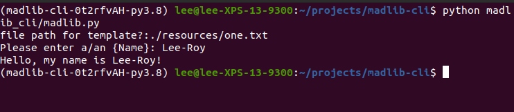

# Console Application README Example

## About Me Quiz

Lab03-Errors Files and Packaging

*Author: Lee-Roy King*

----

## Description
***[Tell me about your application, should be about a paragraph]***
In this lab assignment you will be creating a command line application which takes advantage of Python’s built in capabilities for reading and writing files.

---

### Getting Started
Clone this repository to your local machine.

```
git clone git@github.com:leeroywking/madlib-cli.git
```

### To run the program from VS Code:
Select ```File``` -> ```Open``` -> ```Project/Solution```

Next navigate to the location you cloned the Repository.

Double click on the ```Lab03-madlib-cli``` directory.

Then select and open ```madlib.py```

---

### Visuals




---

### Change Log
1.0 feature complete
1.1 reviewed by Merry, added additional test cases 


------------------------------